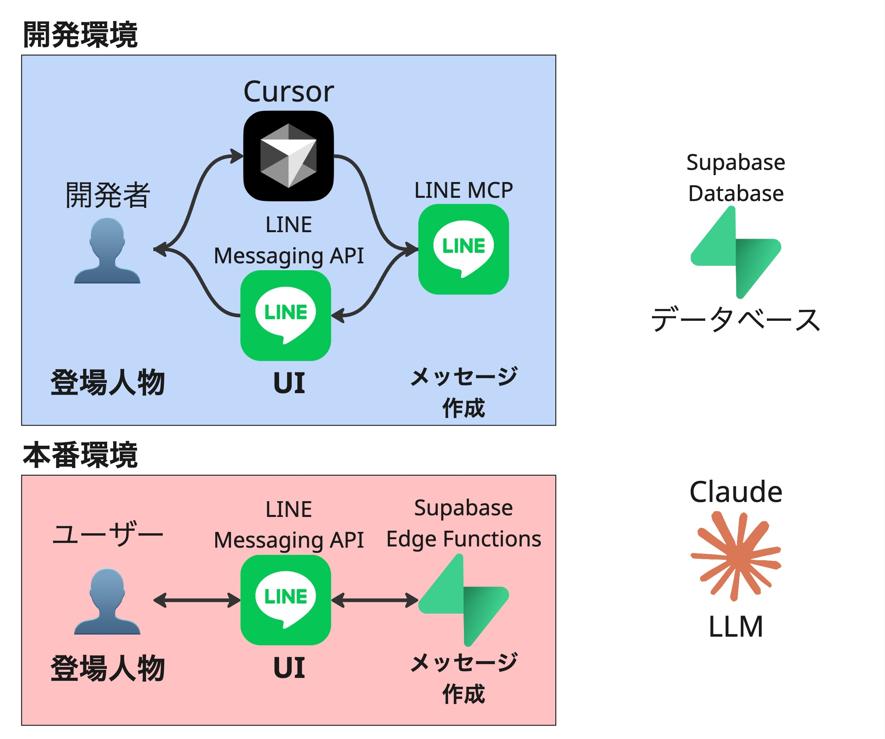

## 📌 概要：ライブコーディングイベントについて

* **イベント名**：Cursor × MCP で、アイデアを形にしていく過程をライブで見学！
* **テーマ**：「Claudeに聞く筋トレアプリ」

---

<div class="flex-row">
  <div class="card">
    <h1>ドライバー：しげる。 </h1>
    <h3>エンジニア@マネーフォワード。LINE API Expert として7年活躍しています。OSSとして、 LINE MCPサーバーの開発してます。</h3>
    
  </div>
  <div class="card">
    <h1>ナビゲーター：たけし </h1>
    <h3>エンジニア@マナリンク。個人開発で「エペタム」と「ジムトモ」の2つのサービスを運営しています！</h3>
    
  </div>
</div>

---

## 🎯 ゴール（目的）

参加者が以下を「学びとして持ち帰る」こと：

1. Supabaseを使ったデータ保存・管理の基本
2. LINE Messaging APIとFlex Messageの活用
3. Claude APIを使った生成AIアプリの構築例
4. 会話設計とUI連携の設計パターン
5. Edge Functionsへのデプロイフロー
---

## 🛠 利用技術
<div class="flex-row">
  <div class="card">
    
  </div>
  <div class="card">

* **LINE Messaging API**
  メッセージ送受信の処理に利用

* **Flex Message**
  LINE上のUI構築に利用

* **Supabase Edge Functions（TypeScript）**
  APIロジックの実装に利用

* **Supabase Database（PostgreSQL）**
  データ保存に利用

* **Claude API**
  筋トレメニューの提案など生成AIに利用

* **LINE MCP**
  Flex Message の表示確認・検証支援に利用

* **Cursor**
  ライブコーディング環境として開発支援に利用
  </div>
</div>

---

## 🤖 ユーザーとBotのコミュニケーションの流れ（対話形式） 🧍‍♂️

> 🧍‍♂️ ユーザー：「今日の筋トレ！」

👉 LINEアプリ上でBotに話しかけます。

> 🤖 Bot：「了解です！どんな目的でトレーニングしたいですか？」

👉 ここで、Botが **目的（例：筋力アップ・ダイエット・健康維持など）** をFlex Message形式の選択肢で提示。

---

> 🧍‍♂️ ユーザー：「筋力アップを目指してます！」

👉 ボタンタップなどで選択。Botはユーザーの意図を取得。

> 🤖 Bot：「OK！体のどの部位を中心に鍛えたいですか？」

👉 こちらもFlex Messageで**部位選択**（上半身・下半身・全身）を提示。

---

> 🧍‍♂️ ユーザー：「上半身かな」

👉 Botは選択内容をもとに、Claude APIに筋トレメニュー生成をリクエスト。

> 🤖 Bot（数秒後）：

「あなたにぴったりのメニューを作成しました！」

📦 **Flex Messageで返信：**

```
🔥 今日の筋トレメニュー（上半身・筋力アップ）🔥

1. プッシュアップ（20回 × 3セット）
2. ダンベルフライ（15回 × 3セット）
3. プランク（60秒 × 3セット）

🏁 頑張ってください！
```

👉 見やすいカード形式のFlex Messageで表示。

---

> 🧍‍♂️ ユーザー：「ありがとう！保存された？」

> 🤖 Bot：「はい、メニューを記録しました📒 過去の履歴もいつでも見られます！」

👉 Supabaseに履歴が保存され、次回のメニュー提案にも活用可能。

---

## 🤖 時間があれば、履歴一覧を作りたい！ 🧍‍♂️

> 🧍‍♂️ ユーザー：「過去の履歴を教えて」

👉 BotがSupabaseから過去の筋トレメニュー履歴を取得。

> 🤖 Bot：「こちらがこれまでのトレーニング履歴です！」

```
📦 Flex Messageで履歴一覧を表示

2025/06/10：上半身・筋力アップメニュー
2025/06/12：全身・ダイエットメニュー
2025/06/15：下半身・健康維持メニュー
```

---
## ⏱ タイムライン前半

| 時間     | 内容                         
| ------ | -------------------------- 
| 20:00〜 | オープニング（概要紹介）
| 20:05〜 | 各利用技術をCursor を使って調査
| 20:15〜 | ① LINE MCPでFlexメッセージの作成
| 20:20〜 | ① Supabaseでデータベース設計
| 20:25〜 | ① Supabase Edge Functionの作成
| 20:30〜 | ① Bot連携＆動作確認

---

## ⏱ タイムライン後半

| 時間     | 内容                         
| ------ | -------------------------- 
| 20:35〜 | ② Claude APIを利用して、カスタマイズ
| 20:40〜 | ② Bot連携＆動作確認
| 20:45〜 | ③ 履歴機能の作成
| 20:50〜 | ③ Bot連携＆動作確認
| 21:00〜 | クロージング


---
## 🛠 利用技術
<div class="flex-row">
  <div class="card">
    
  </div>
  <div class="card">

* **LINE Messaging API**
  メッセージ送受信の処理に利用

* **Flex Message**
  LINE上のUI構築に利用

* **Supabase Edge Functions（TypeScript）**
  APIロジックの実装に利用

* **Supabase Database（PostgreSQL）**
  データ保存に利用

* **Claude API**
  筋トレメニューの提案など生成AIに利用

* **LINE MCP**
  Flex Message の表示確認・検証支援に利用

* **Cursor**
  ライブコーディング環境として開発支援に利用
  </div>
</div>

<!--
カンペ：それぞれのリンク
## LINE Developers
https://developers.line.biz/console/

provider: live-vibe-coding-2025-06-18-provider
bot name: 筋トレくん

## Supabase
https://supabase.com/dashboard/org/dyovuhkazoypfkcqquzk

project_name: live-vibe-coding-2025-06-18-supabase
edge function: live-vibe-coding-2025-06-18-function

## Claude console
https://console.anthropic.com/dashboard
api-key: live-vibe-coding-2025-06-18-claude-key
--->

<style>
.flex-row {
  display: flex;
  gap: 30px;
  justify-content: center;
  align-items: flex-start;
}
.card {
  border: 1px solid #ccc;
  padding: 16px;
  width: 100%;
  box-shadow: 2px 2px 8px rgba(0, 0, 0, 0.1);
  background: white;
}

.card {
  font-size: 16px;
}

.card img {
  display: block;
  margin: 0 auto;
  max-width: 100%;
  height: auto;
}

table {
  margin: 0 auto;
}
</style>